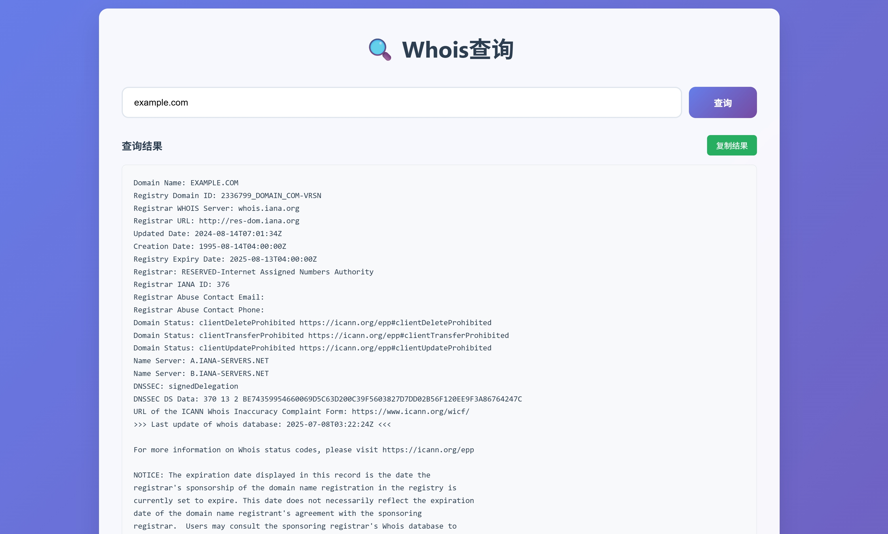

# 在线 Whois 查询



这是一个可以部署在 Cloudflare Workers 上的 Whois 查询工具。它具有以下特点：

- **私有部署**：不用再去用那些乱七八糟又有一堆广告的在线whois工具了。
- **实时查询**：快速获取域名的 Whois 信息。
- **干净简洁**：无多余功能，专注于 Whois 查询。

## 部署方法

1. 确保已注册并登录 [Cloudflare](https://www.cloudflare.com/)。
2. 安装 [Wrangler CLI](https://developers.cloudflare.com/workers/wrangler/)。
3. 克隆此项目到本地：
    ```bash
    git clone https://github.com/your-repo/whois-query.git
    cd whois-query
    npm i
    ```
4. 配置 `wrangler.toml` 文件。
5. 部署到 Cloudflare Workers：
    ```bash
    npx wrangler deploy
    ```

## 使用方法

部署完成后，访问你的 Workers URL，输入域名即可查询对应的 Whois 信息。
